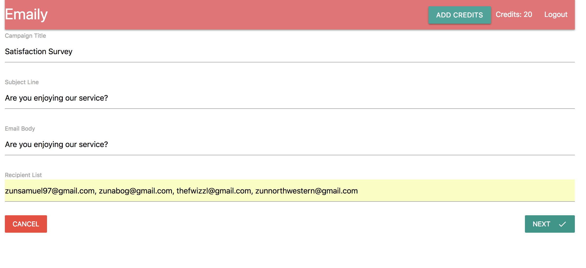
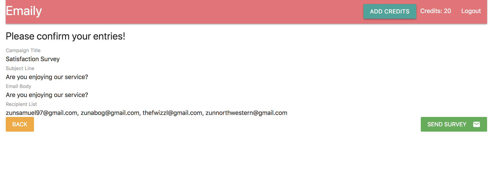
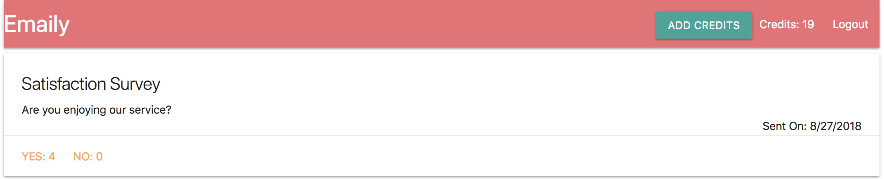

# Emaily

A survey tool for small business owners which allows users to collect data in response to surveys they send out through the site. The site also collects revenue through Stripe, and email-response data using Sendgrid.

## [Deployed Here](https://damp-bayou-34571.herokuapp.com/)






## Getting Started

### Prerequisites

Installing Create-React-App and the latest versions of NPM and Node.

```
$ npm i -g create-react-app@latest
$ npm i -g node@latest
$ npm i -g npm@latest
```

### Installing

After cloning the repo, cd into the directory and install the required npm packages:

```
npm i
```

## Deployment

```
heroku login
heroku create
git add -A
git commit -m "heroku deployment"
git push heroku master
```

## Built With

- [ReactJS](https://reactjs.org/) - The web framework used
- [React Router](https://www.npmjs.com/package/react-router-dom) - Router allowing for single page applications
- [Redux](https://redux.js.org/) - Used for state management
- [Redux Thunk](https://github.com/reduxjs/redux-thunk) - Used for asynchronous state management
- [Axios](https://www.npmjs.com/package/axios) - Used for HTTP Requestsdeployment
- [Redux Form](https://redux-form.com/7.4.2/) - Used for wizard form
- [Materialize CSS](https://materializecss.com/) - CSS Framework
- [Node.js](https://nodejs.org/en/) - Backend
- [Stripe](https://stripe.com/) - Payment Processing
- [Mongoose](https://mongoosejs.com/) - Database ODM
- [Express](https://expressjs.com/) - Node.js Framwork
- [Body-Parser](https://www.npmjs.com/package/body-parser) - Middleware
- [Cookie-Session](https://www.npmjs.com/package/cookie-session) - Sesssion Creation
- [LocalTunnel](https://localtunnel.github.io/www/) - Local Webhook Connection
- [Lodash](https://lodash.com/) - Parsing Tool
- [Passport](http://www.passportjs.org/) - Authentication/Authorization Middleware
- [Passport-Google-OAuth-20](https://github.com/jaredhanson/passport-google-oauth2#readme) - Authentication Through Google +
- [Path-Parser](https://www.npmjs.com/package/path-parser) - Parsing URL
- [Sendgrid](https://sendgrid.com/) - Emailing and webhook

## Authors

- **Sam G Zun** - [SZun](https://github.com/SZun)
